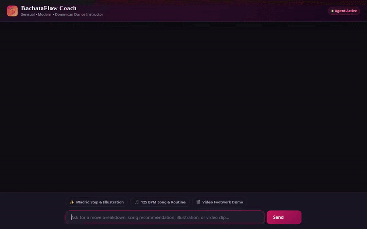

# BachataFlow Coach 💃

An intelligent, multi-modal dance instructor agent built with the Google Agent Development Kit (ADK) and deployed to Google Cloud Agent Platform (Agent Runtime) and Cloud Run. BachataFlow Coach helps dancers learn Bachata fundamentals, breakdown complex Sensual, Modern, and Dominican patterns, discover tempo-matched practice music, and visualize moves with AI-generated illustrations and video demonstrations.

<p align="center">
  
  
</p>
<p align="center">
  <em>Left: Dynamic AI-generated Dominican footwork video demonstration (Gemini Omni Flash Preview).<br>Right: Live agent chat interaction & A2UI card generation.</em>
</p>

---

## 🌟 Key Features & Architecture

BachataFlow Coach integrates real Google Cloud tools and Gemini models:

- **Firestore Move Catalog**: Fetches real dance move data (timing breakdown, lead/follow mechanics, styling, and common pitfalls) stored in Cloud Firestore.
- **Vertex AI Memory Bank**: Preserves user dance preferences (skill level, favorite styles, practice history) across multiple sessions using managed agent memory.
- **A2UI Rich Surface Interface**: Generates interactive UI cards (v0.8 Basic Catalog) with formatted headings, captions, and structured columns rendered natively in the chat frontend.
- **Gemini Flash Lite Image Generation**: Uses `gemini-3.1-flash-lite-image` in the `global` region to synthesize step-by-step visual dance illustrations.
- **Gemini Omni Video Generation**: Uses Google’s `gemini-omni-flash-preview` model via the Interactions API to generate animated video demonstrations.
- **Google Cloud Storage (GCS)**: Stores generated illustration JPGs and video MP4s with public URLs for low-latency streaming and artifact persistence.
- **Code Execution Sandbox**: Integrates `AgentEngineSandboxCodeExecutor` to safely execute Python code in an isolated sandbox environment.
- **Music Recommendation Tool**: Grounds song recommendations in authentic Bachata tempos (BPM) and styles (Sensual, Dominican, Urban/Modern) using the iTunes Search API.

---

## 📁 Repository Structure

```
├── app/
│   ├── agent.py               # Root ADK agent, tools, callbacks, and prompt
│   ├── a2ui_utils.py          # A2UI after_model_callback transformer
│   └── __init__.py
├── frontend/
│   ├── main.py                # FastAPI proxy communicating via A2A protocol
│   ├── requirements.txt
│   ├── Dockerfile             # Container configuration for Cloud Run
│   └── static/
│       └── index.html         # Latin dance themed chat UI & A2UI renderer
├── agents-cli-manifest.yaml   # Agent Engine deployment manifest
├── deployment_metadata.json   # Deployed Agent Runtime identifiers
├── seed_firestore.py          # Script to populate initial Bachata moves into Firestore
├── test_tools.py              # Unit tests for tools and music recommendations
├── workshop_instructions.html # Build with Gemini workshop instructions & prompt manual
├── bachata_coach_demo.gif     # Looping demo of the web chat interface
├── bachata_video_demo.gif     # Looping demo of the AI-generated dance video
└── README.md
```

---

## 🛠️ Deploying to Your Own Google Cloud Project

Follow these steps to replicate and deploy this entire project in your personal Google Cloud account.

### 1. Prerequisites & GCP APIs

1. **Install Prerequisites**:
   - [Google Cloud CLI (`gcloud`)](https://cloud.google.com/sdk/docs/install)
   - Python 3.10+ and [`uv`](https://docs.astral.sh/uv/)
   - `agents-cli`:
     ```bash
     pip install google-agents-cli
     ```

2. **Authenticate with GCP**:
   ```bash
   gcloud auth login
   gcloud auth application-default login
   gcloud config set project <YOUR_PROJECT_ID>
   ```

3. **Enable Required Google Cloud APIs**:
   ```bash
   gcloud services enable      aiplatform.googleapis.com      firestore.googleapis.com      storage.googleapis.com      run.googleapis.com      artifactregistry.googleapis.com      cloudbuild.googleapis.com
   ```

---

### 2. Set Up Cloud Storage & Firestore

1. **Create Public Cloud Storage Bucket for Media**:
   ```bash
   export PROJECT_ID=$(gcloud config get-value project)
   export BUCKET_NAME="bachataflow-coach-${PROJECT_ID}"

   gcloud storage buckets create gs://${BUCKET_NAME} --location=us-central1
   # Make objects publicly readable so images and videos stream directly to the web UI:
   gcloud storage buckets add-iam-policy-binding gs://${BUCKET_NAME}      --member=allUsers      --role=roles/storage.objectViewer
   ```

2. **Initialize Firestore & Seed Move Data**:
   - Create a Firestore Native database if not already created:
     ```bash
     gcloud firestore databases create --location=us-central1 --type=firestore-native
     ```
   - Seed the initial move catalog:
     ```bash
     pip install google-cloud-firestore
     python seed_firestore.py
     ```

---

### 3. Deploy Backend Agent to Agent Runtime (Agent Engine)

1. **Deploy the Agent**:
   ```bash
   agents-cli deploy --project ${PROJECT_ID} --region us-central1 --no-confirm-project
   ```
   *Note: This command generates `deployment_metadata.json` which contains your deployed `remote_agent_runtime_id`.*

2. **Grant Agent Runtime Permissions**:
   The deployed Agent Runtime runs under a managed service account (`service-<PROJECT_NUMBER>@gcp-sa-aiplatform-re.iam.gserviceaccount.com`). Grant it the required roles:
   ```bash
   export PROJECT_NUMBER=$(gcloud projects describe ${PROJECT_ID} --format="value(projectNumber)")
   export RE_SA="service-${PROJECT_NUMBER}@gcp-sa-aiplatform-re.iam.gserviceaccount.com"

   # Firestore access to read/write dance moves:
   gcloud projects add-iam-policy-binding ${PROJECT_ID}      --member="serviceAccount:${RE_SA}"      --role="roles/datastore.user"

   # Storage access to upload generated illustrations and videos:
   gcloud storage buckets add-iam-policy-binding gs://${BUCKET_NAME}      --member="serviceAccount:${RE_SA}"      --role="roles/storage.objectAdmin"

   # Vertex AI access to call Omni and Flash Lite models:
   gcloud projects add-iam-policy-binding ${PROJECT_ID}      --member="serviceAccount:${RE_SA}"      --role="roles/aiplatform.user"
   ```

---

### 4. Deploy Frontend Web UI to Cloud Run

1. **Deploy Container to Cloud Run**:
   ```bash
   cd frontend
   export AGENT_ENGINE_RESOURCE_NAME=$(python3 -c "import json; print(json.load(open(../deployment_metadata.json))[remote_agent_runtime_id])")

   gcloud run deploy bachataflow-coach-ui      --source .      --region us-central1      --allow-unauthenticated      --set-env-vars AGENT_ENGINE_RESOURCE_NAME="${AGENT_ENGINE_RESOURCE_NAME}",AGENT_DIRECTORY="app"
   ```

2. **Grant Cloud Run Access to the Agent**:
   Grant the Cloud Run default compute service account permission to call the Reasoning Engine:
   ```bash
   export RUN_SA="${PROJECT_NUMBER}-compute@developer.gserviceaccount.com"

   gcloud projects add-iam-policy-binding ${PROJECT_ID}      --member="serviceAccount:${RUN_SA}"      --role="roles/aiplatform.user"
   ```

3. Open the output Cloud Run Service URL in your browser to start using your deployed coach!

---

## 💻 Local Development

### Run Agent in ADK Playground
```bash
uv run adk web . --port 8000 --reload_agents
```

### Run Frontend Locally
```bash
cd frontend
export AGENT_ENGINE_RESOURCE_NAME="projects/<PROJECT_ID>/locations/us-central1/reasoningEngines/<ENGINE_ID>"
export AGENT_DIRECTORY="app"
export PORT="8080"
python main.py
```
Navigate to [http://localhost:8080](http://localhost:8080).

---

## 🧪 Running Tests

Run the test suite verifying move lookups, routine sequencing, and song search:
```bash
uv run python -m unittest test_tools.py
```
